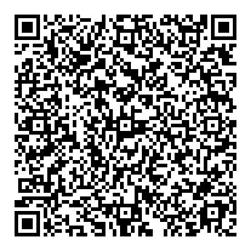

<h1 align="center"> NODTECH 
</h1>

<h2>¿Quiénes Somos?
</h2>

**_Equipo de Desarrollo_**
+ [Freddy Leon](https://github.com/Freddyleonn16), Quality Assurance
+ [Carolina Alvarado](https://github.com/carolaljime21), UX/UI Developer
+ [Byron Castillo](https://github.com/ByronCast09), Frontend Developer
+ [Kevin Barrazueta](https://github.com/0KevinB), Security Manager
+ [Kevin Bustamante](https://github.com/Kevin0232), Backend Developer
+ [Pablo Ramon](https://github.com/Pablo-26), Software Architect

### 1) Descripción del Reto

Este proyecto tiene como objetivo implementar un sistema en la nube para llevar un registro actualizado y accesible del estado de las instalaciones del campus universitario, mejorando la seguridad y adecuación del entorno para estudiantes, docentes y personal. La aplicación permitirá a los responsables de mantenimiento registrar edificios, aulas y espacios específicos, creando checklists personalizados para monitorear insumos y condiciones necesarias, como mobiliario y equipos.

El sistema facilitará a los usuarios la revisión, actualización y reporte del estado de las instalaciones desde cualquier dispositivo, almacenando todos los datos en la nube. Esto asegura que la información esté disponible de manera constante y centralizada, eliminando la dependencia de un único dispositivo o ubicación.

Tras cada revisión, el sistema generará y almacenara informes que evidenciaran la inspección del campus de la universidad. En caso de registrar incidencias, se solicitara el debido mantenimiento o reposicion de las intalaciones o equipamiento. Este proyecto en la nube optimiza la gestión de las instalaciones, mejorando la capacidad de respuesta del personal de mantenimiento y asegurando un entorno universitario en condiciones óptimas para todos.

### 5) Prototipo

[Prototipo en Figma](https://www.figma.com/proto/qfBDe3dvxPt1WmxA9wJMcJ/CheckList-Campus---Prototipo?node-id=10-19&node-type=canvas&t=pJ2V16c24miJ6MCF-1&scaling=scale-down&content-scaling=fixed&page-id=10%3A18&starting-point-node-id=10%3A19)

  

